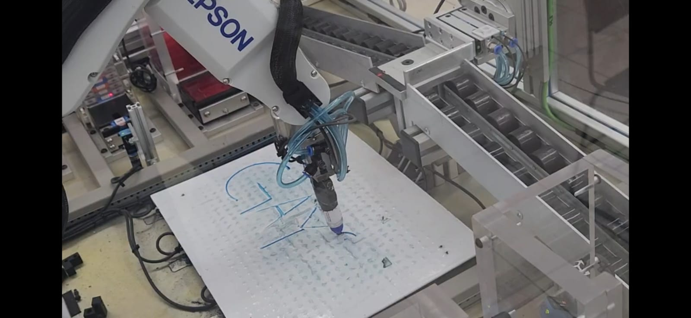

# PRÁCTICA-4

## Introducción
Esta práctica consistió en la implementación de la dinámica robótica mediante coordenadas para realizar una acción específica. El objetivo fue utilizar el robot Epson C4, al cual se le colocó un plumón en la punta, para implementar la acción de escritura mediante el brazo robótico.

## Instrucciones
### Programación de coordenadas

Se utilizó el software Epson RC+ para definir las coordenadas esenciales para el movimiento del brazo robótico. Se establecieron 4 coordenadas clave, sirviendo cada una como punto inicial para la escritura de su respectiva letra: "G", "A", "I" y "SS". Registrar estos puntos fue crucial para asegurar un desplazamiento seguro y eficiente, evitando colisiones con el entorno y realizando la acción de manera dinámica.

### Programación final mediante código

A diferencia de prácticas anteriores, en esta ocasión se empleó únicamente una coordenada por letra. En lugar de guardar una cantidad significativa de puntos para realizar la trayectoria especificada, se utilizaron sumas y restas de coordenadas en cada punto, lo que evitó la necesidad de realizar pruebas manuales para trazar cada letra. De esta manera, al sumar y restar coordenadas, lo único que restaba era asignar los 4 puntos clave con su respectiva separación.

El código que se implementó para ejecutar la tarea es el siguiente:

```
Function main

Home

Move G +Y(50) +Z(20)
Move G +Y(50)
Arc G -X(50), G +X(20) -Y(40)
Go G -Y(50) +Z(20)
Move G
Move G +X(50)
Move G -Y(50) +X(50)
Go G -Y(50) +X(50) +Z(20)

Move A -Y(100) -X(25)
Move A
Move A -Y(100) +X(25)
Move A -Y(50) +X(13)
Move A -Y(50) -X(13)
Move A -Y(50) -X(13) +Z(20)

Move I -X(25) +Y(40)
Pass I
Move I +X(25) +Y(40)
Move I +X(25) +Y(40) +Z(20)
Move I
Move I -Y(60)
Move I -Y(60) +Z(20)

Move SS +Y(50)
Arc SS -X(25) +Y(25), SS
Arc SS +X(25) -Y(25), SS -Y(50)

Home

Fend
```

El proceso comienza en el punto "Home" como siempre. Se hizo uso de comandos como Move, que permitió realizar la escritura de manera precisa a una velocidad moderada. En caso de haber utilizado el comando Go, el movimiento habría sido más rápido pero menos preciso, lo cual no era lo ideal para este objetivo en específico. Como se mencionó anteriormente, a cada punto clave se le implementó una suma de coordenadas dada en mm, y siguiendo una secuencia se pudo realizar el trazo de cada letra. Se utilizó el comando de movimiento Arc, el cual permitió establecer los puntos de inicio, medio y final de trazos curvados necesarios en algunas letras. Asimismo, cuando era necesario, se ajustó la altura en el eje Z para escribir únicamente cuando se deseaba.




## Conclusiones
- *Edgar Zahid Hernandez Garcia:*
La implementación de sumas y restas de coordenadas me permitió comprender y trabajar de manera más intuitiva con la trayectoria a trazar, además de ahorrarnos bastante tiempo en lo que podríamos haber tardado en guardar cada punto de trazado. Igualmente, la implementación de los comandos de movimiento Move y Arc, en lugar de Go, nos permitió realizar trazados más precisos, lo cual fue fundamental al tener como objetivo la escritura.

- *Gael Mateo Rangel Chavez:*

  
- *Alejandro Saldaña Garcia:*
 

